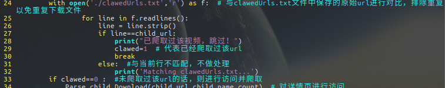

#　Crawler_of_tieba_video
#### 这是一款网络定向爬虫，针对百度“搞笑视频”（ｕｒｌ地址可以更改为其他吧）

#### 用到的库
> * Requests
> * BeautifulSoup
> * urllib
> * re

#### 主要思路

1. *先request.get(url)获取搞笑视频吧首页的网页源码*
2. *用BeautifuSoup和re配合提取首页源码中的各个子页面的url*
3. *利用循环把每一个子页面再按照和主页面一样的思路进行提取url，区别是这里提取的是视频url*
4. *最后用再吧解析出来的视频url用这个函数下载下来*
      `urllib.request.urlretrieve(video_url,'&s.mp4' &(video_name))`
> **注：在第３步中可以再优化一下，如果是长期使用，难免会碰到重复的视频，可以把每次爬取到的url都存在一个文件中，下载视频前进行比对，若之前下载过了，则直接跳过即可。**

### **THE END**
---
### 如有任何问题，还请多多指教！
