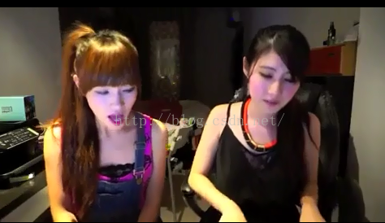
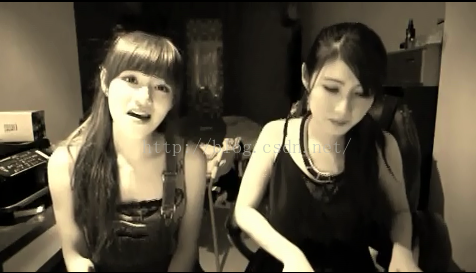
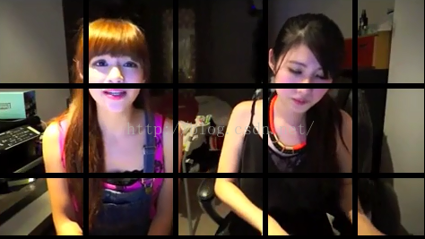
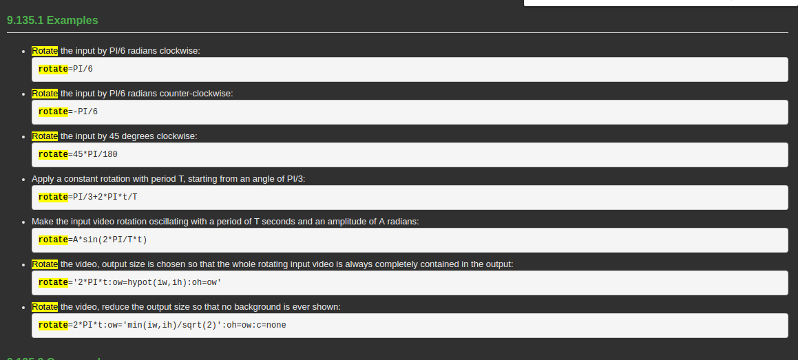
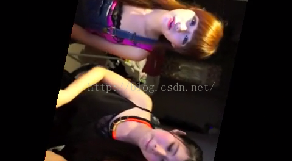
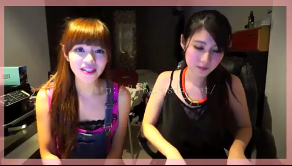

# ffmpeg 使用笔记
>　website:http://www.ffmpeg.org/ffmpeg-filters.html#colorchannelmixer

### filters
### 原始图片

> * **filters--001**
> 褐色处理：
colorchannelmixer=.393:.769:.189:0:.349:.686:.168:0:.272:.534:.131;
**效果图**

> 这里有一段变成褐色调的代码，但程度比上面的图清的多

 `curves=r='0/0.11 .42/.51 1/0.95':g='0/0 0.50/0.48 1/1':b='0/0.22 .49/.44 1/0.8'`

> * **filters--002**
> drawgrid 画网格
给出起始坐标 和 网格的宽高颜色就可以绘画出一个网格覆盖在视频上。
使用举例：
drawgrid=width=100:height=100:thickness=2:color=black@0.9
**效果图**

> * **filters--003**
>  rotate 旋转视频帧，但是面板大小仍然是原视频大小，所以当没有刻意增大面板时旋转之后，除了会有部分黑色区域外，还会有部分是显示不出来的。
它接受t和n作为变量，通过表达式可以实现动态的控制旋转角度。
举例：

**效果图**

> * **filters--004**
> 在视频的四周画一个宽度为20的颜色条，宽度和颜色可自定义
> drawbox=t=20
**效果图**

>* **filters--005**
> 剪切视频，自定义输出尺寸
> `ffmpeg -i 1.mp4 -vf 'crop=w=iw-70:h=ih:x=12:y=34' out.flv`
> **width=in_width-70; height=in_height**

